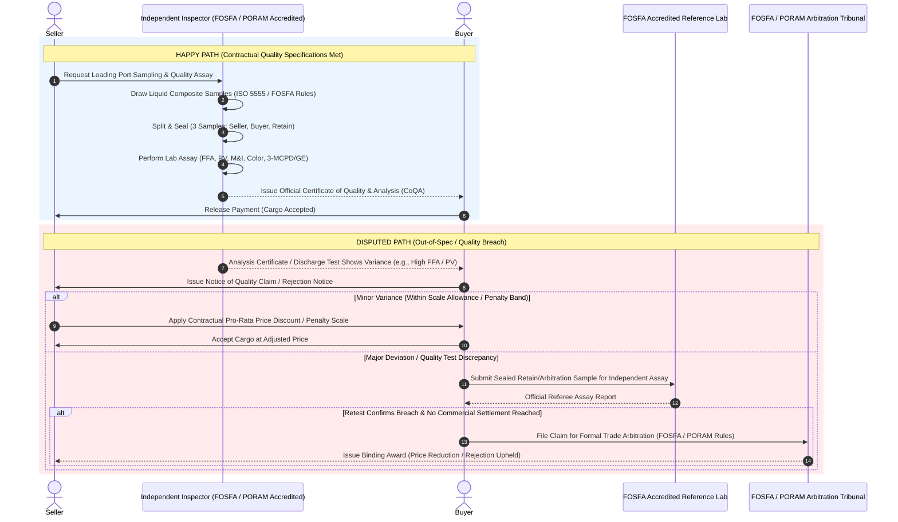

# Physical Edible Oils Trading Quality Assay Process

In physical edible oils trading (crude and refined palm oil, soybean oil, sunflower oil, rapeseed oil), quality testing—known as the **sampling, grading, and assay process**—is a fundamental component of commercial transactions. Because bulk liquid vegetable oils and animal fats are susceptible to chemical degradation (oxidation, hydrolysis), contamination, and rancidity during ocean transit or tank storage, contracts strictly mandate standardized sampling and laboratory testing protocols. These operations are governed globally by standard trade associations and technical bodies including **FOSFA** (Federation of Oils, Seeds and Fats Associations), **PORAM** (Palm Oil Refiners Association of Malaysia), **NIOP** (National Institute of Oilseed Products), **AOCS** (American Oil Chemists' Society), and **ISO**.

---

## 1. Key Contract Quality Parameters

Physical edible oil contracts specify strict chemical, physical, and food safety thresholds that dictate shelf-life stability, refining yield, human consumption safety, and industrial usability:

| Parameter | Description | Contract Impact |
| :--- | :--- | :--- |
| **Free Fatty Acids (FFA)** | Percentage of unbonded fatty acids resulting from the hydrolytic cleavage of triglycerides (measured as oleic, palmitic, or lauric acid). | Primary quality indicator and refining cost driver. High FFA indicates hydrolytic degradation, reduces refining yield, and triggers tiered price discounts or cargo rejection. |
| **Peroxide Value (PV)** | Concentration of primary oxidation products (peroxides and hydroperoxides) measured in milliequivalents of active oxygen per kg ($meq/kg$). | Measures initial stage of oxidative rancidity and oil freshness. High PV leads to off-flavors, poor shelf life, and commercial price deductions. |
| **Moisture & Impurities (M&I / IVI)** | Percentage weight of non-fatty matter, free water, and suspended solids. | Water accelerates hydrolysis (increasing FFA), while solids clog filters and equipment. Excess M&I incurs 1:1 or 2:1 price allowances or rejection. |
| **Iodine Value (IV)** | Measure of total unsaturation in the oil (grams of iodine absorbed per 100 grams of oil). | Dictates crystallization behavior, fractioning potential, and firmness (e.g., distinguishing olein vs. stearin in palm oil). |
| **Color (Lovibond Scale)** | Visual color intensity evaluated using standardized red, yellow, neutral glass filters in a Lovibond tintometer. | Critical for consumer acceptance and deodorization processing costs. Darker oil requires higher bleaching earth consumption. |
| **Contaminants & Process Contaminants (3-MCPD, GE, Heavy Metals)** | Concentration of 3-monochloropropane-1,2-diol (3-MCPD) esters, Glycidyl Fatty Acid Esters (GE), and heavy metals (lead, arsenic). | Regulated strictly by food safety authorities (e.g., EFSA, FDA). Exceeding maximum statutory limits triggers immediate cargo rejection or health authority seizure. |

---

## 2. Process Workflows: Happy Path vs. Disputed Path

### The Happy Path
1. **Sampling at Loading/Discharge Port:** Independent superintendents/inspectors accredited by FOSFA or PORAM (e.g., SGS, Cotecna, Intertek, Bureau Veritas) draw representative liquid samples from shore tanks, pipeline autosamplers, or ship tanks using standardized sampling methods (FOSFA Sampling Rules / ISO 5555).
2. **Sample Division & Tamper-Evident Sealing:** The homogenized composite sample is split and sealed into official, light-protected tamper-evident containers:
   * **Seller Sample**
   * **Buyer Sample**
   * **Arbitration / Retain Sample** (held by the independent superintendent)
3. **Laboratory Analysis:** The nominated FOSFA-analyst laboratory runs analytical testing (FFA, PV, M&I, IV, Lovibond Color, 3-MCPD/GE, Heavy Metals) using standardized test procedures (AOCS / ISO / FOSFA methods).
4. **Certificate Issuance:** A **Certificate of Quality and Analysis (CoQA)** and **Certificate of Sampling** are formally issued.
5. **Settlement:** If all test results fall within contractual tolerances, the buyer accepts the shipping documents and releases payment via Letter of Credit (LC) or cash against documents.

---

### The Disputed Path
1. **Notice of Quality Claim / Rejection:** Upon receipt of load port analysis certificates or after discharge re-inspection, the buyer identifies an out-of-spec parameter (e.g., elevated FFA, high PV indicating oxidation, or excess 3-MCPD esters). The buyer must issue a formal Notice of Claim within strict contractual timeframes (typically within 14–21 days under FOSFA/PORAM rules).
2. **Joint Retesting of Retain Sample:** The official sealed *Arbitration / Retain Sample* held by the superintendent at loading is dispatched to an independent, mutually agreed-upon FOSFA-accredited reference laboratory for referee re-analysis.
3. **Resolution & Remediation:**
   * **Scale Allowances & Price Discounts:** For minor deviations (e.g., Crude Palm Oil FFA at $5.3\%$ vs. $5.0\%$ baseline standard), standard contractual penalty scales (e.g., 1:1 or 2:1 price allowances calculated on the bill of lading value) are applied to adjust the final commercial invoice.
   * **Re-refining Allowance or Off-Site Blending:** If color or peroxide levels are elevated but treatable, the seller compensates the buyer for additional bleaching earth or processing costs required during refining.
   * **Cargo Rejection / Deviation:** If critical safety thresholds or maximum contract limits (e.g., 3-MCPD/GE limits breached, or FFA exceeding absolute rejection caps) are breached, the buyer rejects the cargo. The seller must re-route, blend off-site, or negotiate a distress discount.
   * **Formal Trade Arbitration (FOSFA 125 / PORAM):** If the parties cannot reach a commercial settlement or dispute testing validity, the case is escalated to formal binding trade arbitration under FOSFA or PORAM rules.

---

## 3. Workflow Sequence Diagram

