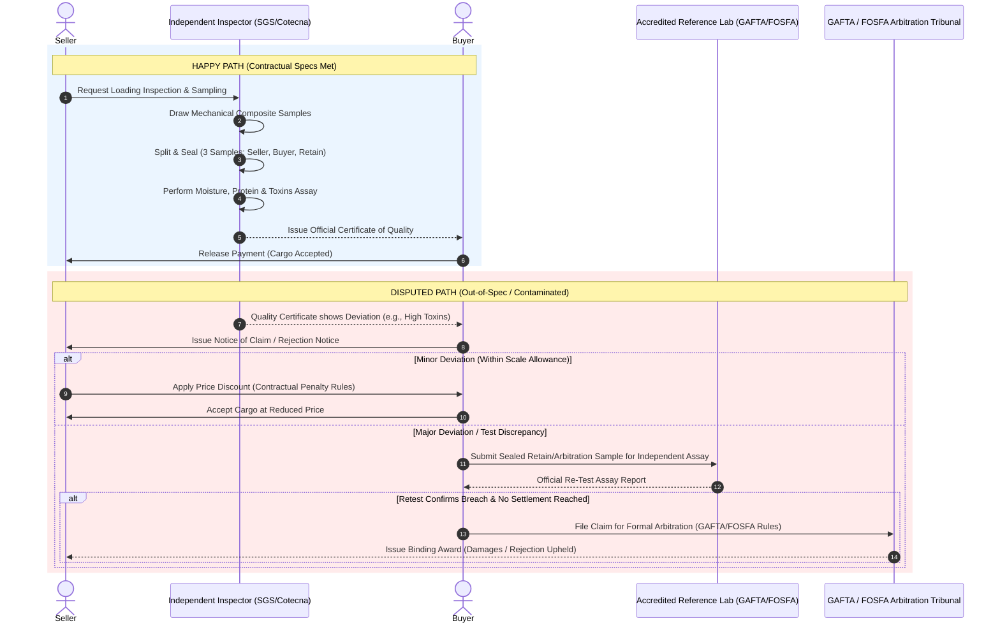

# Grain Physical Trading Quality Assay Process

In physical grain trading (wheat, corn, soybeans, barley), quality testing—known as the **sampling and grading/assay process**—is a critical component of the transaction. Because bulk grain is solid, heterogeneous, and prone to spoilage, insect damage, or fungal toxins, contracts heavily mandate standardized sampling and testing protocols. These protocols are governed globally by trade associations such as **GAFTA** (Grain and Feed Trade Association) or **FOSFA** (Federation of Oils, Seeds and Fats Associations), or federally by bodies like the **USDA/FGIS** (Federal Grain Inspection Service).

---

## 1. Key Contract Quality Parameters

Physical grain contracts specify strict thresholds for physical characteristics, nutritional value, and safety parameters:

| Parameter | Description | Contract Impact |
| :--- | :--- | :--- |
| **Moisture Content** | Percentage of water weight in the grain. | High moisture causes mold, heating, and spoilage during ocean transit. Excess moisture results in price discounts or rejection. |
| **Protein Content** | Total nitrogen content (primarily evaluated in wheat). | Key indicator of gluten strength for baking and milling quality. Premium paid for high protein; discount applied if below spec. |
| **Falling Number (Hagberg)** | Measures enzyme activity (alpha-amylase) caused by sprout damage. | Low falling numbers indicate sprouted grain, causing poor dough structure and lower milling value. |
| **Foreign Material (FM) / Impurities** | Dirt, weeds, stones, chaff, and non-target crop seeds. | Higher FM reduces usable yield. Contracts set maximum percentages before penalization. |
| **Test Weight (Bushel Weight)** | Density of the grain per unit volume (e.g., kg/hl or lbs/bushel). | Direct indicator of kernel plumpness and expected milling/flour yield. |
| **Mycotoxins / Contaminants** | Toxic fungal metabolites such as Aflatoxin, Vomitoxin (DON), or Ochratoxin A. | Regulated strictly by food safety laws. Exceeding safety limits results in immediate cargo rejection. |
| **Broken / Damaged Kernels** | Heat-damaged, insect-damaged, or physically fractured grains. | Affects storage stability and end-product quality. |

---

## 2. Process Workflows: Happy Path vs. Disputed Path

### The Happy Path
1. **Sampling at Loading:** Independent inspection companies (e.g., SGS, Cotecna, Bureau Veritas) draw samples during loading using automated cross-cut samplers or manual probes (spears) according to GAFTA/FOSFA rules.
2. **Sample Division & Sealing:** The composite sample is homogenized, divided, and sealed into three official, tamper-evident samples:
   * **Seller Sample**
   * **Buyer Sample**
   * **Arbitration / Retain Sample** (kept by the independent inspector)
3. **Laboratory Analysis:** The primary inspector runs physical tests (moisture, test weight, broken kernels) and chemical/analytical tests (protein, falling number, mycotoxins).
4. **Certificate Issuance:** A **Certificate of Quality** is issued.
5. **Settlement:** If all parameters meet or exceed contract specifications, the buyer accepts the documentation and releases payment via Letter of Credit or cash against documents.

---

### The Disputed Path
1. **Notice of Claim / Rejection:** Upon arrival at the discharge port (or upon receipt of the loading assay certificate), the buyer or receiver identifies an out-of-spec parameter (e.g., moisture exceeds maximum, protein below minimum, or presence of mycotoxins). The buyer must issue a formal claim within strict contractually defined timeframes (often within 14–21 days under GAFTA/FOSFA).
2. **Joint Testing of Retain Sample:** The sealed *Arbitration/Retain Sample* drawn at loading is sent to a GAFTA/FOSFA-accredited independent reference laboratory for official re-testing.
3. **Resolution & Remediation:**
   * **Scale Allowances / Deductions:** For minor physical variances (e.g., moisture at 14.3% vs. 14.0% contract max), standardized contractual penalty scales (e.g., 1:1 or 2:1 price allowances) are applied to adjust the final invoice.
   * **Cargo Rejection / Blending:** If safety thresholds are breached (e.g., excessive mycotoxins), the buyer rejects the cargo. The seller must re-tender, re-route, or negotiate a distress-sale discount.
   * **Trade Arbitration (GAFTA 125/126 or FOSFA):** If the parties cannot agree on test validity, damages, or rejection terms, the dispute proceeds to a formal trade tribunal for a binding arbitral award.

---

## 3. Workflow Sequence Diagram

