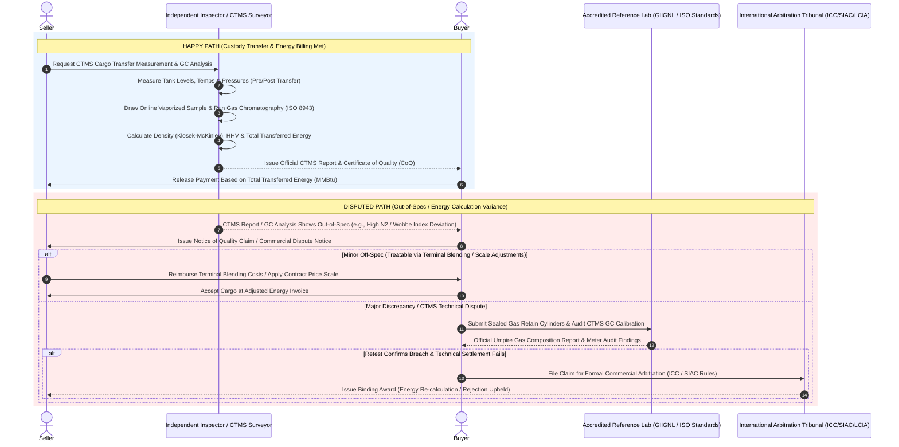

# Physical LNG Trading Quality Assay & Custody Transfer Process

In physical Liquefied Natural Gas (LNG) trading, quality assaying and quantity determination—collectively known as the **Custody Transfer Measurement System (CTMS)** process—are central to commercial transactions. Because LNG is stored and transported at cryogenic temperatures ($\approx -160^\circ\text{C}$), undergoes dynamic phase changes, and continuously generates **Boil-Off Gas (BOG)** during transit, energy quantity determination relies on both precise liquid volume measurement and gas chromatography analysis. These operations are governed globally by standard agreements (such as MSA/SPA terms) and technical frameworks including the **GIIGNL LNG Custody Transfer Handbook**, **ISO**, **ASTM**, and **GPA** (Gas Processors Association) standards.

---

## 1. Key Contract Quality Parameters

Physical LNG contracts specify strict physical, chemical, and combustion thresholds that dictate pipeline gas interchangeability, regasification plant operations, and downstream grid safety:

| Parameter | Description | Contract Impact |
| :--- | :--- | :--- |
| **Gross Heating Value (GHV / HHV)** | Total energy released per unit volume of gas ($MJ/m^3$ or $Btu/SCF$) under complete combustion. | Primary commercial energy pricing factor. LNG is bought and sold on total energy content (MMBtu or Joules), calculated directly from HHV and total transferred mass/volume. |
| **Wobbe Index (WI)** | Indicator of the interchangeability of fuel gases, defined as $WI = \frac{HHV}{\sqrt{SG}}$ (where $SG$ is Specific Gravity). | Dictates burner/turbine stability in receiving markets. Gas outside the WI specification can cause incomplete combustion or equipment failure, triggering nitrogen/LPG blending penalties or cargo rejection. |
| **Methane Number (MN)** | Measure of the knock resistance of gaseous fuel in internal combustion engines (analogous to Octane Rating). | Critical for LNG used as heavy transport fuel or gas engine power generation. Low MN causes engine knocking and performance degradation. |
| **Methane & Hydrocarbon Composition ($C_1 - C_5+$)** | Percentage concentration of Methane ($CH_4$), Ethane ($C_2H_6$), Propane ($C_3H_8$), Butane ($C_4H_{10}$), and Pentanes+ ($C_5+$). | Dictates heavy/light LNG categorization. Rich/heavy LNG contains higher $C_2+$ fractions, affecting pricing differentials and regasification stripping requirements. |
| **Nitrogen ($N_2$) & Carbon Dioxide ($CO_2$) Content** | Incombustible inert gas content. $N_2$ accelerates Boil-Off Gas (BOG) rates, while $CO_2$ risks freezing in cryogenic units. | Excess $N_2$ lowers HHV, causes BOG management issues at receiving terminals, and incurs contractual penalties or rejection if $CO_2$ exceeds freezing thresholds ($\sim 50\text{ ppm}$). |
| **Sulfur Compounds ($H_2S$, Total S, Mercaptans)** | Mass concentration of hydrogen sulfide, total sulfur, and odorizing mercaptans. | Environmental and pipeline corrosion limit. $H_2S$ limits are strictly enforced (typically $< 5\text{ mg/Nm}^3$); exceeding limits results in rejection. |
| **Boil-Off Gas (BOG) Impact & Density** | Liquid density ($\text{kg/m}^3$) calculated via state equations (e.g., Klosek-McKinley method) combined with BOG composition. | During transit, lighter $C_1$ boils off preferential to heavier hydrocarbons ("weathering"), aging the cargo and altering energy density between loading and discharge ports. |

---

## 2. Process Workflows: Happy Path vs. Disputed Path

### The Happy Path
1. **Custody Transfer Measurement System (CTMS) at Loading/Discharge:** Independent marine surveyors (e.g., SGS, Intertek, Bureau Veritas) conduct pre- and post-transfer gauging on board the LNG carrier:
   * Tank liquid level measurement via primary radar/capacitance gauges.
   * Temperature profiling across cryogenic tank heights using multi-spot platinum resistance thermometers (PRTs).
   * Tank vapor space pressure measurement.
2. **Online Sampling & Gas Chromatography (GC):** Continuous inline vapor samples are drawn during bulk discharge/loading via vaporizer sampling loops and fed directly into on-site Gas Chromatographs (GC) following **ISO 8943** / **GIIGNL** guidelines. Alternatively, spot/composite vapor samples are collected in sample cylinders.
3. **Calculation of Transferred Energy:** Using the CTMS level readings, liquid volume is determined from official ship tank calibration tables (**Trim and List adjusted**). Liquid density is calculated (e.g., revised Klosek-McKinley equation) from GC composition data, yielding total mass. Energy ($E$) in MMBtu or Joules is derived by multiplying mass by the calculated Gross Heating Value (GHV).
4. **Certificate Issuance:** A **Certificate of Quality (CoQ)**, **Certificate of Quantity**, and **Certificate of Customary Transfer Measurement (CTMS Report)** are formally issued.
5. **Settlement:** The buyer verifies the energy calculation ($Energy = Volume \times Density \times HHV - BOG/Gas\ Return\ Adjustments$) and releases payment against the final invoice.

---

### The Disputed Path
1. **Notice of Quality / Energy Discrepancy:** Upon completion of custody transfer or receipt of the load/discharge CTMS package, a party identifies an out-of-spec parameter (e.g., excess $N_2$, Wobbe Index breach, or significant discrepancy between loading CoQ and discharge test values). A formal Notice of Claim is issued within contractually stipulated timeframes (typically 14–30 days under SPA/GTC terms).
2. **Umpire Retesting & GC Calibration Audit:**
   * **Sample Cylinder Retest:** Retain vapor samples collected in sealed stainless-steel sampling cylinders during custody transfer are sent to an agreed-upon independent referee laboratory (ISO 17025 accredited).
   * **Equipment & Metering Audit:** Independent experts audit CTMS calibration logs, radar gauge verifications, vaporizer operational temperatures, and Gas Chromatograph carrier gas/calibration standard gas records.
3. **Resolution & Remediation:**
   * **Off-Spec Energy / Blending Adjustments:** If the LNG falls outside the agreed Wobbe Index or HHV bandwidth but remains treatable, contractual price adjustments or reimbursement for regasification blending costs (e.g., nitrogen injection or LPG enriching) are applied.
   * **Boil-Off Gas Allowance Adjustments:** If transit times or cool-down procedures exceeded agreed allowances, energy losses attributed to excessive BOG weathering are re-calculated according to contractual boil-off formulas.
   * **Cargo Rejection / Deviation:** If critical limits (e.g., severe $H_2S$ contamination or freeze-risk $CO_2$ levels) are breached, the buyer rejects the cargo. The seller must re-route or negotiate a distress discount.
   * **Formal Dispute Arbitration:** Unresolved technical errors in GC analysis or volume calculation formulas escalate to formal international arbitration under designated rules (e.g., ICC, SIAC, or LCIA).

---

## 3. Workflow Sequence Diagram

