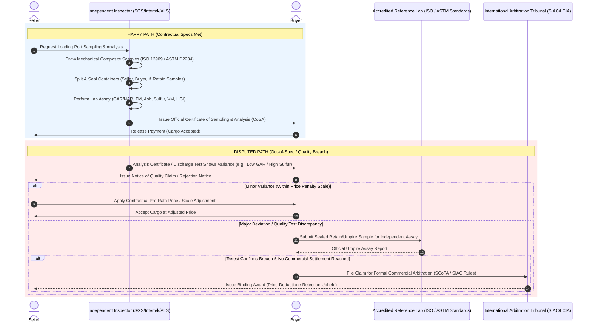

# Coal Physical Trading Quality Assay Process

In physical coal trading (thermal and metallurgical/coking coal), quality testing—known as the **sampling and assay process**—is a fundamental component of commercial transactions. Because bulk coal is solid, heterogeneous, and varies significantly in energy content, moisture, and chemical composition, contracts heavily mandate standardized sampling and laboratory analysis protocols. These operations are governed globally by standard trading terms such as **SCoTA** (Standard Coal Trading Agreement) and technical standards bodies including **ASTM International** and **ISO** (International Organization for Standardization).

---

## 1. Key Contract Quality Parameters

Physical coal contracts specify strict physical, chemical, and thermal thresholds that dictate power plant efficiency, emissions compliance, or steelmaking suitability:

| Parameter | Description | Contract Impact |
| :--- | :--- | :--- |
| **Calorific Value (GAR / NAR)** | Gross As Received (GAR) or Net As Received (NAR) energy content in kcal/kg. | Primary pricing determinant. Higher CV generates more heat per ton. Price is scaled proportionally; falling below rejection thresholds allows cargo rejection. |
| **Total Moisture (TM) & Inherent Moisture (IM)** | Total water weight percentage contained in and on the coal. | Moisture adds non-usable weight and reduces net useful energy (NAR). High moisture incurs price penalties or cargo rejection. |
| **Ash Content** | Non-combustible mineral residue remaining after complete burning. | High ash reduces thermal efficiency, increases handling/disposal costs, and causes boiler slagging. Subject to price deductions. |
| **Sulfur Content** | Total mass percentage of sulfur present. | Critical for environmental compliance ($SO_x$ emissions). High sulfur causes corrosion and incurs severe price discounts or rejection. |
| **Volatile Matter (VM)** | Percentage of gas/vapor released when coal is heated without air. | Determines ignition ease and flame stability in boilers, or coking properties in steelmaking. Exceeding contracted ranges triggers penalties. |
| **Hardgrove Grindability Index (HGI)** | Measure of coal's resistance to crushing/grinding. | Dictates power consumption and wear in pulverizer mills. Lower HGI values mean harder coal and potential throughput bottlenecks. |

---

## 2. Process Workflows: Happy Path vs. Disputed Path

### The Happy Path
1. **Sampling at Loading Port:** Independent inspection companies (e.g., SGS, Intertek, Bureau Veritas, ALS) draw mechanical cross-belt or falling-stream samples during vessel loading following ASTM D2234 / ISO 13909 standards.
2. **Sample Division & Sealing:** The representative composite sample is prepared, divided, and sealed into official tamper-evident sample containers:
   * **Seller Sample**
   * **Buyer Sample**
   * **Retain / Umpire Sample** (retained by the independent inspector)
3. **Laboratory Analysis:** The nominated inspector runs core analytical tests (GAR/NAR, Total Moisture, Ash, Volatile Matter, Sulfur, HGI) in an accredited laboratory at the load port according to ISO/ASTM standard test methods.
4. **Certificate Issuance:** A **Certificate of Sampling and Analysis (CoSA)** / **Certificate of Quality** is officially issued.
5. **Settlement:** If all test results fall within contractual specifications, the buyer accepts the documentation and releases payment via Letter of Credit (LC) or cash against documents.

---

### The Disputed Path
1. **Notice of Claim / Discrepancy:** Upon arrival at the discharge terminal (or upon receipt of load port analysis certificates), the buyer's re-inspection or discharge testing reveals an out-of-spec parameter (e.g., lower GAR/NAR, elevated Total Moisture, or high Sulfur). The buyer issues a formal Notice of Claim within strict contractual timeframes (typically within 14–30 days under standard coal terms like SCoTA).
2. **Joint Retesting of Retain Sample:** The sealed *Retain / Umpire Sample* generated at the load port is dispatched to a mutually agreed-upon independent referee/umpire laboratory (an accredited ISO/ASTM facility).
3. **Resolution & Remediation:**
   * **Pro-Rata Energy Adjustment & Scale Penalties:** For minor heat or moisture variances (e.g., GAR lower than contract baseline but above rejection limit), contractual pro-rata price adjustments or tiered penalty scales (e.g., cents-per-kcal/kg adjustments) are applied to recalculate the final invoice price.
   * **Cargo Rejection / Re-Tendering:** If critical safety, environmental, or operational limits are breached (e.g., sulfur exceeding absolute maximum cap or GAR below rejection limit), the buyer rejects the cargo. The seller must re-route, blend off-site, or negotiate a distress discount.
   * **Formal Dispute Arbitration:** If the parties cannot agree on testing methodology validity or financial damages, the dispute escalates to formal commercial arbitration under international trade rules (e.g., SIAC, LCIA, or LMAA).

---

## 3. Workflow Sequence Diagram

