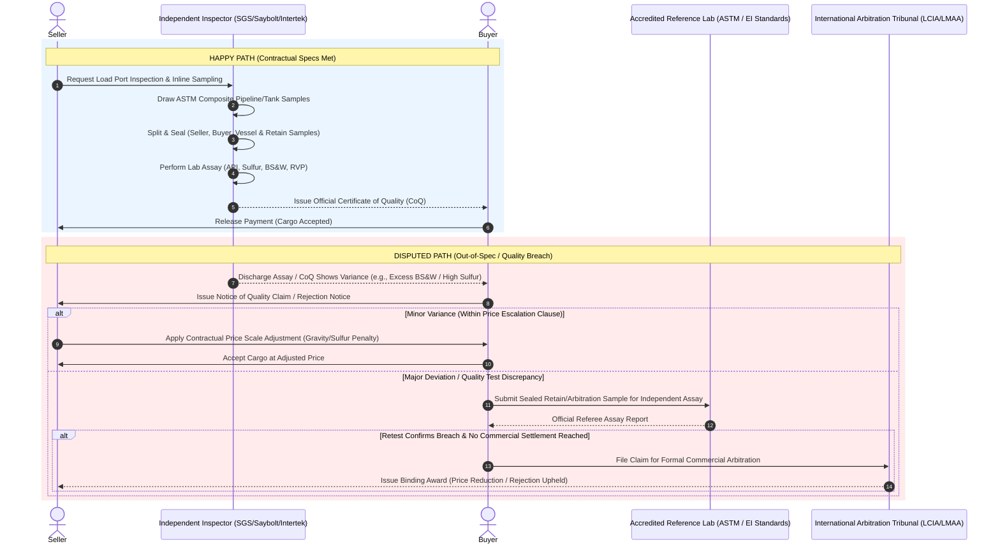

# Physical Oil Trading Quality Assay Process

In physical oil trading (crude oil and refined petroleum products), quality testing—known as the **sampling and assay process**—is a fundamental component of commercial transactions. Because bulk liquid hydrocarbons are volatile, heterogeneous across batches, and varied in chemical composition, contracts mandate standardized sampling and laboratory analysis protocols. These operations are governed globally by trade and technical standard bodies such as **ASTM International** (American Society for Testing and Materials), the **Energy Institute (EI)**, and international marine/commodity terms (e.g., BP GTCs, Shell GTCs).

---

## 1. Key Contract Quality Parameters

Physical oil contracts specify strict physical and chemical thresholds that dictate refinery processing efficiency, environmental compliance, and commercial valuation:

| Parameter | Description | Contract Impact |
| :--- | :--- | :--- |
| **API Gravity / Density** | Measure of relative liquid density compared to water at $60^\circ\text{F}$. | Determines yield. Light crude ($>31.1^\circ\text{ API}$) yields valuable fuels (gasoline/diesel) and commands a premium over heavy crude ($<22.3^\circ\text{ API}$). |
| **Sulfur Content** | Total mass percentage of sulfur present in the oil. | Categorizes crude as **Sweet** ($\le 0.5\%$) or **Sour** ($> 0.5\%$). High sulfur requires complex refinery desulfurization and incurs price discounts. |
| **Basic Sediment & Water (BS&W)** | Volume percentage of free/emulsified water and suspended solids. | Excess water causes equipment corrosion, pipeline sludge, and distillation unit disruption. Contracts set strict maximum caps (typically $\le 0.5\%$). |
| **Reid Vapor Pressure (RVP)** | Absolute vapor pressure exerted by the liquid at $100^\circ\text{F}$ ($37.8^\circ\text{C}$). | Indicates volatility and safety during storage/ocean transit. High RVP in gasoline or crude can cause vapor lock or atmospheric venting losses. |
| **Viscosity & Pour Point** | Resistance to flow and lowest temperature at which liquid remains fluid. | Critical for pipeline hydraulics and marine pumpability. High pour point crude requires heated storage and transport. |
| **Heavy Metals (Vanadium/Nickel)** | Concentration of trace metallic elements in residual fractions. | Poison refinery catalysts and accelerate high-temperature corrosion in boilers and cracking units. |
| **Acid Number (TAN)** | Total Acid Number measuring organic acidity (primarily naphthenic acids). | High TAN ($>0.5\text{ mg KOH/g}$) causes severe naphthenic acid corrosion in refinery distillation units, requiring price adjustments. |

---

## 2. Process Workflows: Happy Path vs. Disputed Path

### The Happy Path
1. **Sampling at Loading Terminal:** Independent inspection companies (e.g., SGS, Saybolt, Intertek, Bureau Veritas) draw composite samples during loading via automatic inline pipeline samplers or manual tank composite sampling (dips/running samples) following ASTM D4057 / D4177 standards.
2. **Sample Division & Sealing:** The representative composite sample is homogenized, split, and sealed into official tamper-evident sample bottles:
   * **Seller Sample**
   * **Buyer Sample**
   * **Retain / Vessel Sample** (held on board or retained by the independent inspector)
3. **Laboratory Analysis:** The nominated inspector runs core analytical tests (API gravity, sulfur content, BS&W, distillation profile, flash point) in a certified testing laboratory at the load port.
4. **Certificate Issuance:** A **Certificate of Quality (CoQ)** and **Certificate of Quantity (CoQ/CoA)** are officially issued.
5. **Settlement:** If all test results fall within contractual specifications, the buyer accepts the documentation and releases payment via Letter of Credit (LC) or cash against documents.

---

### The Disputed Path
1. **Notice of Claim / Discrepancy:** Upon arrival at the discharge terminal (or upon receipt of load port analysis certificates), the buyer's discharge inspection reveals an out-of-spec parameter (e.g., elevated BS&W, lower API gravity, or excessive sulfur). The buyer issues a formal Notice of Claim within strict contractual timeframes (typically within 14–30 days under standard oil GTCs).
2. **Joint Retesting of Retain Sample:** The sealed *Retain/Arbitration Sample* generated at the load port is dispatched to a mutually agreed-upon independent referee laboratory (e.g., an accredited ASTM/EI facility).
3. **Resolution & Remediation:**
   * **Escalation / Price Gravity Adjustment:** For minor physical variances (e.g., API gravity lower by $0.5^\circ\text{ API}$ or sulfur slightly above target), standard contractual escalation tables (e.g., cents-per-barrel adjustments) are applied to adjust the final invoice price.
   * **Off-Spec Deductions & Demurrage Settlement:** If excess water/sediment is present, deductions for water volume are applied, alongside compensation for extra vessel discharge pump time.
   * **Cargo Rejection / Blending:** If critical safety or processing limits are breached (e.g., flash point violation making cargo unsafe for transport), the buyer rejects the cargo. The seller must re-route, blend off-site, or negotiate a distress discount.
   * **Formal Dispute Arbitration:** If the parties cannot agree on testing methodology validity or financial damages, the dispute escalates to formal commercial arbitration under international trade rules (e.g., LCIA, LMAA, or UNCITRAL).

---

## 3. Workflow Sequence Diagram

