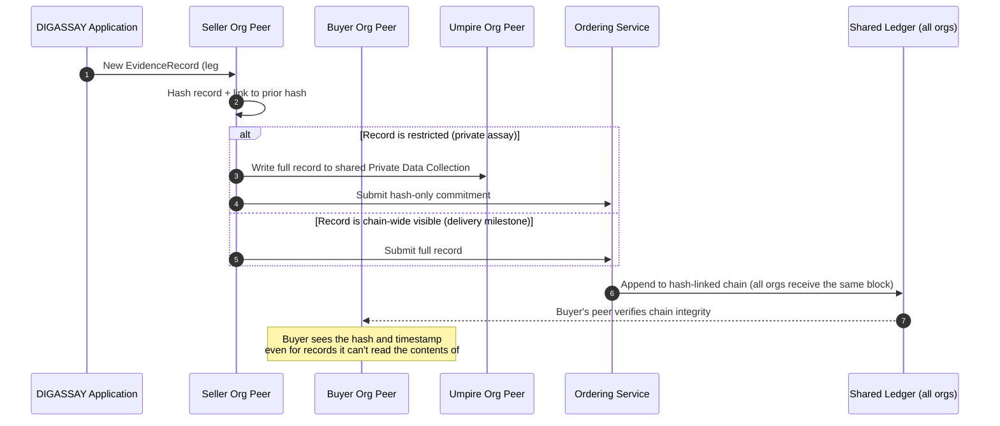

# Immutable Data — Execution

See **[Overview](Overview.md)** for why, and **[Concept](Concept.md)** for the model. This page grounds it in one real, illustrative technology stack and shows what the pieces would actually look like — not a commitment to build on this specific platform, but a concrete example proving the model in [Concept](Concept.md) is buildable with mature, existing tools rather than something speculative.

## 1. Illustrative platform: a permissioned distributed ledger

**Hyperledger Fabric** (Linux Foundation) is used here as the illustrative reference — a mature, permissioned distributed-ledger platform purpose-built for exactly the shape described in [Concept](Concept.md): known, identified participants; a shared hash-linked ledger; and, critically, a native mechanism for restricting a given record's actual contents to a named subset of participants while every participant still shares the same tamper-evident history. Other permissioned platforms offer comparable mechanics — Fabric is chosen here because its two building blocks map directly onto the two needs in [Concept](Concept.md):

| Fabric concept | Maps to |
| :--- | :--- |
| **Channel** | A sub-ledger visible only to its members — e.g. one channel per counterparty pair, or one per contract |
| **Private Data Collection** | Within a channel, a record whose actual contents are stored only on the peers of *named* authorised organisations — every other channel member still sees a tamper-evident hash of it on the shared ledger, just not the contents |
| **Organisation / MSP (Membership Service Provider)** | Each counterparty (seller, buyer, umpire, carrier) is a distinctly identified organisation, admitted via a certificate authority — mapped, in DIGASSAY's case, onto the real company/LEI registry identity already established for counterparties today |
| **Ordering service** | Agrees the sequence new entries are appended in, so every participant's copy of the ledger ends up identical |

## 2. Participants

| Organisation | Role | Sees |
| :--- | :--- | :--- |
| Seller | Commissions private assays, ships product | Own private records + full shared chain hashes |
| Buyer | Receives product, contests quality | Own private records + full shared chain hashes |
| Umpire / Assayist | Produces assay reports | Only the private collection(s) it's named on |
| Carrier | Executes a transport leg | Only inspection reports for legs it's party to |
| DIGASSAY | Orders/sequences entries, hosts the application layer | Chain hashes for every record; contents only where explicitly a named party |

## 3. Data flow



Every participant's peer independently verifies each new entry links correctly to the one before it before accepting it — there's no single "master" copy any one organisation, DIGASSAY included, could quietly edit without every other peer's copy immediately disagreeing.

## 4. Illustrative private collection definition

A record's visibility is declared at the point it's written, not bolted on afterwards. Illustrative — the exact syntax is platform-specific and this is not a published DIGASSAY schema:

```json
{
  "collectionName": "seller_commissioned_assay_SC-000002_delivery_7",
  "policy": "OR('SellerOrgMSP.member', 'AssayistOrgMSP.member')",
  "memberOnlyRead": true,
  "requiredPeerCount": 1,
  "maxPeerCount": 2,
  "blockToLive": 0
}
```

`policy` names exactly which organisations' peers are allowed to hold and read the actual contents — here, only the Seller and the named Assayist. Every other organisation on the same channel — including the Buyer and DIGASSAY's own ordering layer — still receives and can verify the record's hash commitment on the shared ledger, just never the underlying document, unless a future entry (e.g. a dispute escalation) explicitly widens the policy to add them.

## 5. Where DIGASSAY's existing data maps in

No new data model is needed — the roadmap step maps records that already exist in the live product:

| Live today (`digassay-api`) | Roadmap ledger role |
| :--- | :--- |
| `EvidenceRecord` | One entry per inspection — chain-wide visible, or restricted via a Private Data Collection depending on `Outcome`/parties involved |
| `AssayExchange` / assay records | Seller/Buyer/Umpire results — each result restricted to the org(s) that produced it until formally exchanged |
| `DeliveryLegTracking` | Chain-wide visible milestones (planned/actual timestamps) — the backbone of the shared, always-visible part of the chain |
| Company/LEI registry identity | Root of the org/MSP identity used to admit participants |

## Status

Roadmap — illustrative only. No ledger platform has been selected or committed to; Fabric is used above because its mechanics are a close, provable match to the model in [Concept](Concept.md), not because it's the intended production choice.
