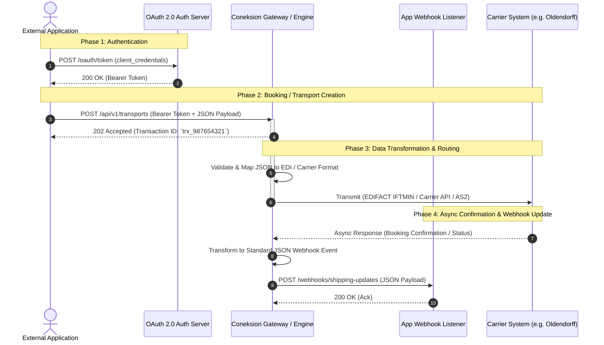

# Integration Guide: Connecting an Application to Coneksion (Youredi)

## Overview
**Coneksion** (developed by Youredi) is a cloud-native Integration-as-a-Service (IaaS) middleware platform designed for global logistics and maritime transport. It bridges proprietary logistics software, Enterprise Resource Planning (ERP) systems, and Transport Management Systems (TMS) with ocean carriers, bulk operators, and terminal networks.

---

## 1. System Architecture & Flow (Mermaid Diagram)

The following diagram illustrates the end-to-end data flow between your external application, the Coneksion Integration Platform, and downstream carrier/logistic systems.



---

## 2. Authentication & Connection Protocol

Coneksion utilizes standard **OAuth 2.0 (Client Credentials Grant)** over HTTPS for securing REST API endpoints.

### Authentication Endpoint
`POST https://auth.coneksion.com/oauth/token`

#### Headers
```http
Content-Type: application/x-www-form-urlencoded
```

#### Request Body
```form-urlencoded
grant_type=client_credentials
&client_id=YOUR_CLIENT_ID
&client_secret=YOUR_CLIENT_SECRET
&scope=transport:write transport:read
```

#### Token Response Example
```json
{
  "access_token": "eyJhbGciOiJIUzI1NiIsInR5cCI6IkpXVCJ9...",
  "token_type": "Bearer",
  "expires_in": 3600,
  "scope": "transport:write transport:read"
}
```

---

## 3. REST API Endpoints

All data requests to Coneksion require the Bearer token and tenant identification headers.

| Action | HTTP Method | Endpoint Path | Description |
| :--- | :--- | :--- | :--- |
| **Create Transport / Booking** | `POST` | `/api/v1/transports` | Submits a new booking or shipping instruction request. |
| **Get Transport Status** | `GET` | `/api/v1/transports/{id}` | Fetches current processing state and status of a shipment. |
| **Cancel Transport** | `POST` | `/api/v1/transports/{id}/cancel` | Submits a cancellation request to the carrier. |

---

## 4. Full JSON Payload Request Template

Below is the complete JSON structure for creating a bulk or ocean container booking via Coneksion.

```json
{
  "header": {
    "senderReference": "APP-REF-2026-10045",
    "messageType": "BOOKING_REQUEST",
    "timestamp": "2026-09-14T08:00:00Z",
    "environment": "PRODUCTION"
  },
  "parties": {
    "shipper": {
      "companyName": "Global Mining Corp",
      "address": "100 Industry Way",
      "city": "Rotterdam",
      "country": "NL",
      "contactEmail": "logistics@globalmining.com",
      "contactPhone": "+31101234567",
      "taxId": "NL888888888B01"
    },
    "consignee": {
      "companyName": "Pacific Steel Industries",
      "address": "45 Ocean Drive",
      "city": "Singapore",
      "country": "SG",
      "contactEmail": "receiving@pacificsteel.sg"
    },
    "carrier": {
      "scacOrCode": "OLDN",
      "name": "Oldendorff Carriers",
      "accountNumber": "OLDN-ACCT-4421"
    },
    "notifyParty": {
      "companyName": "Pacific Steel Logistics Ltd",
      "address": "12 Terminal Road, Singapore",
      "country": "SG"
    }
  },
  "routing": {
    "portOfLoading": {
      "unlocode": "AUWAL",
      "name": "Port Walcott",
      "country": "AU"
    },
    "portOfDischarge": {
      "unlocode": "CNQIN",
      "name": "Qingdao",
      "country": "CN"
    },
    "estimatedDepartureDate": "2026-10-05",
    "estimatedArrivalDate": "2026-10-22",
    "vesselName": "TRUDI OLDENDORFF",
    "imoNumber": "9876543",
    "voyageNumber": "2026-V12"
  },
  "cargo": {
    "commodityDescription": "Iron Ore Fines",
    "hsCode": "260111",
    "grossWeight": 150000,
    "weightUnit": "MT",
    "volume": 65000,
    "volumeUnit": "CBM",
    "isHazardous": false,
    "containerDetails": []
  }
}
```

---

## 5. Data Field Dictionary

### Header Fields

| Field Path | Type | Required | Description / Allowed Values |
| :--- | :--- | :--- | :--- |
| `header.senderReference` | String | Yes | Unique ID generated by your application (Max 35 chars). |
| `header.messageType` | String | Yes | Enum: `BOOKING_REQUEST`, `SHIPPING_INSTRUCTION`, `TRACKING_STATUS`. |
| `header.timestamp` | String | Yes | ISO 8601 UTC timestamp (`YYYY-MM-DDTHH:mm:ssZ`). |
| `header.environment` | String | No | Enum: `SANDBOX`, `PRODUCTION`. Default: `PRODUCTION`. |

### Parties Fields

| Field Path | Type | Required | Description / Allowed Values |
| :--- | :--- | :--- | :--- |
| `parties.shipper.companyName` | String | Yes | Legal name of the exporting/shipping entity. |
| `parties.consignee.companyName` | String | Yes | Legal name of the receiving entity. |
| `parties.carrier.scacOrCode` | String | Yes | Standard Carrier Alpha Code (SCAC) or ocean code (e.g., `OLDN`, `MAEU`). |
| `parties.carrier.accountNumber` | String | No | Customer reference/contract account with the target carrier. |

### Routing & Cargo Fields

| Field Path | Type | Required | Description / Allowed Values |
| :--- | :--- | :--- | :--- |
| `routing.portOfLoading.unlocode` | String | Yes | 5-character UN/LOCODE (e.g., `DEHAM`, `AUWAL`). |
| `routing.portOfDischarge.unlocode` | String | Yes | 5-character UN/LOCODE (e.g., `SGSIN`, `CNQIN`). |
| `routing.vesselName` | String | No | Name of the assigned vessel. |
| `routing.imoNumber` | String | No | 7-digit IMO ship identification number. |
| `cargo.commodityDescription` | String | Yes | Clear textual description of cargo. |
| `cargo.grossWeight` | Decimal | Yes | Weight value. |
| `cargo.weightUnit` | String | Yes | Enum: `KGS`, `LBS`, `MT`. |

---

## 6. Asynchronous Webhook Notification Payload

Once Coneksion processes the request with the carrier, it pushes real-time updates to your configured webhook URL.

### Request Sent by Coneksion to App Endpoint
`POST https://api.yourapp.com/webhooks/shipping-updates`

#### HTTP Headers
```http
Content-Type: application/json
X-Coneksion-Signature: sha256=d7a8f3b... (HMAC verification)
```

#### Webhook JSON Payload
```json
{
  "eventId": "evt_20260914_009821",
  "eventType": "BOOKING_CONFIRMED",
  "timestamp": "2026-09-14T08:15:30Z",
  "data": {
    "senderReference": "APP-REF-2026-10045",
    "coneksionTransactionId": "trx_987654321",
    "carrierReference": "OLDN-BK-992011",
    "status": "CONFIRMED",
    "vesselName": "TRUDI OLDENDORFF",
    "imoNumber": "9876543",
    "scheduledDeparture": "2026-10-05T12:00:00Z",
    "scheduledArrival": "2026-10-22T06:00:00Z",
    "remarks": "Booking confirmed on spot charter agreement OLDN-2026-C8."
  }
}
```
