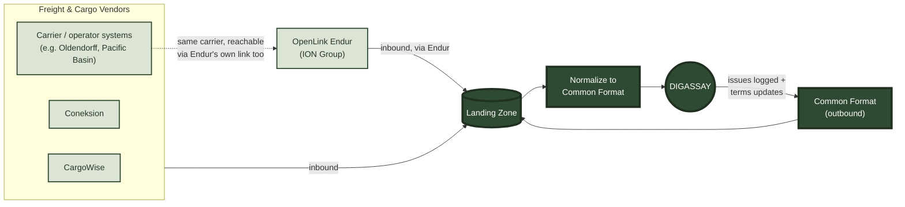

# Freight & Cargo Integrations — v1.00

Master page for DIGASSAY's freight/cargo vendor integration architecture — real, published vendor messaging formats and API contracts that DIGASSAY's own `DeliveryLegTracking` / `EvidenceRecord` data model is designed to connect to. Each vendor has its own child page (numbered `1.01`, `1.02`, ... below) with full technical detail; this page explains how the pieces fit together as one architecture, not three unrelated one-offs. None of the three is wired into the live demo today — the pages document exactly how each connection would work, against each vendor's own real, current integration surface.

## The three vendors

| # | Vendor | What it is |
| :--- | :--- | :--- |
| [1.01](<Freight and Cargo 1.01 CargoWise.md>) | **CargoWise** (WiseTech Global) | Enterprise freight-forwarder logistics platform - eAdaptor XML messaging (`UniversalShipment` / `UniversalEvent`). |
| [1.02](<Freight and Cargo 1.02 Coneksion.md>) | **Coneksion** (Youredi) | Cloud integration-as-a-service middleware for ocean/bulk carrier connectivity - OAuth 2.0 REST API + webhooks. |
| [1.03](<Freight and Cargo 1.03 Endur.md>) | **OpenLink Endur** (ION Group) | Front-to-back ETRM/CTRM platform (trade, risk, logistics) - JVS/OpenComponents, User Tables, DEX. Targets release S25. |

## How the pieces fit together

Two of the three (CargoWise, Coneksion) connect straight to their own vendor networks. The third, Endur, **already has its own established links to many of those same carriers** as part of its own Logistics/Operations module - so a given carrier's data can reach DIGASSAY either **directly** through its own connector, or **indirectly by way of Endur**, if that's the path the counterparty or trading desk already uses. Either way, everything lands in one place and is normalized to one internal shape before DIGASSAY ever sees it - DIGASSAY is never written to know three different vendor formats.

The connection is two-way. DIGASSAY doesn't just consume tracking data - it reports back: inspection issues logged against a leg (see the Inspection Evidence table in the delivery diary) go back out to the relevant carrier electronically, and DIGASSAY keeps the vendor side informed as a contract's main terms change, rather than that sync happening by phone or email.

**Landing Zone → Common Format** — every inbound message, whichever vendor or path it arrived by, lands here first and is normalized into one internal shape (the same shape DIGASSAY's own `DeliveryLegTracking` / `EvidenceRecord` tables already use) before DIGASSAY consumes it. A new vendor is one more thing writing into the Landing Zone, not a new thing DIGASSAY has to learn to speak.

**Return loop** — the same Landing Zone/Common Format layer runs in reverse: an inspection issue raised in DIGASSAY, or a contract term change, is written out in the common shape and translated back into each vendor's own format (a CargoWise `UniversalEvent`, a Coneksion webhook call, an Endur `DEX` update) for delivery to whichever system actually needs to hear about it.
