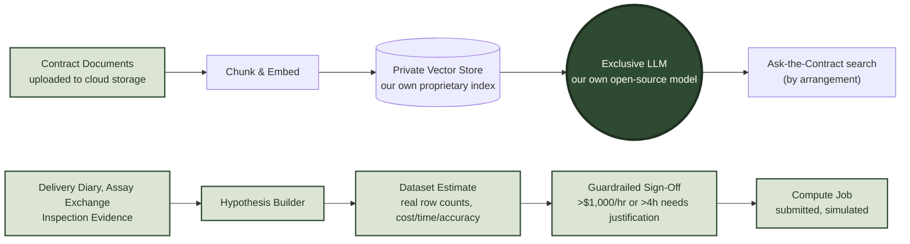

# Knowledge Base & Compute

The reasoning behind two live pages on the platform — **Knowledge Base** (the contract documents themselves, chunked and embedded for retrieval) and **Compute** (where analysis against the platform's own historical data actually runs) — see the [ecosystem diagram](https://github.com/DIGASSAY) for how they sit relative to the rest of the product. This page explains why the platform's own delivery history is the raw material worth building on, what "our own LLM" actually means in practice, and the deployment shape that keeps proprietary trading data inside the organisation's own walls.

## Why look backward to look forward

Every delivery DIGASSAY records — the legs, the tracking timestamps, the inspection evidence, the assay outcomes, the contract terms behind them — is a data point about how a physical trade actually played out, not just how it was planned. On its own, one delivery tells you little. Hundreds of deliveries, across routes, counterparties, seasons and commodities, tell you which railhead reliably runs late in winter, which carrier's legs turn up the most inspection issues, which quality clause tends to trigger a dispute. That pattern only becomes visible once there's enough real history to look back over — which is exactly what the live platform has been accumulating since day one (see **Supply Contracts**, **Delivery Diary & Logistics** and **Assay Exchange** in the [ecosystem diagram](https://github.com/DIGASSAY)).

## Deployment options

There are three broad ways to host a model and the data behind it. Each carries a different cost shape and a different amount of operational control:

| | Cloud | On-Premises | Hybrid |
| :--- | :--- | :--- | :--- |
| **Cost shape** | Operating expense — pay for GPU compute by the hour/token, scales with actual usage | Capital expense — GPU hardware bought upfront, plus power, cooling, rack space and depreciation | Mostly operating expense, but only for the minutes the model is actually running |
| **Typical driver** | No upfront spend, fast to stand up, elastic — scale GPU capacity up for a run and back down after | Full control of the physical hardware and the network it sits on; no recurring bill once paid for; data never leaves the building | Best of both: no idle hardware sitting depreciating in a rack, but the model still isn't reachable except by design |
| **Where the data sits** | In a cloud account under the organisation's own control, but still someone else's data-centre | Physically on-site | In a private, isolated compute environment, spun up only when needed |
| **Illustrative cost** | Roughly $2–8/hour for a GPU instance capable of running a mid-size open-source LLM, i.e. a few hundred dollars for an occasional run, or real money if left running continuously | A single on-prem GPU server capable of the same workload is commonly a $15,000–$40,000+ one-off, before power/cooling/maintenance | Cloud-style hourly cost, but billed only for the actual run time — a nightly job might cost a few dollars a month rather than a few hundred |

*(Figures above are illustrative, for demonstration purposes only — not a costed procurement, and not tied to any specific vendor.)*

### The hybrid idea

The approach DIGASSAY actually uses leans hybrid: rather than a model running continuously on always-on hardware (on-prem) or a permanently-provisioned cloud endpoint, the inference service is **spun up on demand, sealed off from the public internet, and reachable only by authorised internal users** through the same authenticated-session gate already protecting other sensitive actions on the platform. When a run finishes, the service is torn back down. This keeps the cost profile close to on-demand cloud pricing while keeping the exposure profile close to on-prem — there is no standing public endpoint to secure, patch or worry about, because for most of the day there is no endpoint at all.

## Our own proprietary knowledge, our own exclusive LLM

The model behind Knowledge Base is deliberately **not** a call out to a third-party hosted API. It's the organisation's own deployment of an open-source language model, run inside the environment described above, paired with a vector store built entirely from DIGASSAY's own data:

**Chunk & embed** — a contract document, once uploaded, is split and turned into numeric embeddings capturing its meaning, not just its raw text.

**Private vector store** — those embeddings populate a vector database that exists only inside the organisation's own environment. It holds nothing but DIGASSAY's own documents — no third party ever sees it, and it is never used to train or fine-tune anyone else's model.

**Exclusive LLM** — an open-source model, run from the organisation's own copy of the weights rather than a hosted API, so a query never leaves the sealed environment described above. The **Knowledge Base** page carries this pipeline today: document upload and ingest are live; free-text search over the index is available **by arrangement** (disabled in the public demo).

**Compute** is the second half — where analysis against the platform's own historical data actually runs, rather than where documents are searched. Defining a hypothesis and picking the data-dictionary columns it draws on produces a real markdown manifest and a genuine current row count from the underlying tables, then a cost/time/accuracy appraisal per compute tier. Submitting a job requires an explicit sign-off — with a mandatory written justification once the estimate crosses $1,000/hour or 4 hours — before it's allowed to go ahead; the job itself is simulated, not executed, so the guardrail can be explored without any real cost or delay.

## Try it

Both pages are live at **[digassay.nrgpix.com](https://digassay.nrgpix.com)** — **Knowledge Base** for the document/vector-store pipeline, **Compute** for hypothesis definition through to guardrailed sign-off.
