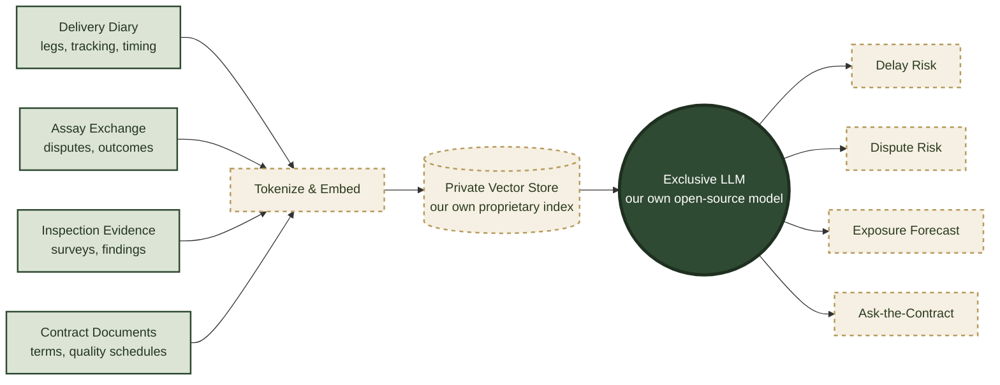

# Knowledge Base — Historical Deliveries

Part of the **Knowledge Base** roadmap item shown in the [org ecosystem diagram](https://github.com/DIGASSAY) (dashed, not yet built). This page explains the idea in more depth: why the platform's own delivery history is the raw material for prediction, what "our own LLM" actually means in practice, and the deployment shape that keeps proprietary trading data inside the organisation's own walls.

## Why look backward to look forward

Every delivery DIGASSAY records — the legs, the tracking timestamps, the inspection evidence, the assay outcomes, the contract terms behind them — is a data point about how a physical trade actually played out, not just how it was planned. On its own, one delivery tells you little. Hundreds of deliveries, across routes, counterparties, seasons and commodities, tell you which railhead reliably runs late in winter, which carrier's legs turn up the most inspection issues, which quality clause tends to trigger a dispute. That pattern only becomes visible once there's enough real history to look back over — which is exactly what the live platform has been accumulating since day one (see **Supply Contracts**, **Delivery Diary & Logistics** and **Assay Exchange** in the [ecosystem diagram](https://github.com/DIGASSAY)). The Knowledge Base and Predictive roadmap items exist to put that accumulated history to work, rather than letting it sit as an unexamined audit trail.

## Deployment options

There are three broad ways to host the model and the data behind it. Each carries a different cost shape and a different amount of operational control:

| | Cloud | On-Premises | Hybrid |
| :--- | :--- | :--- | :--- |
| **Cost shape** | Operating expense — pay for GPU compute by the hour/token, scales with actual usage | Capital expense — GPU hardware bought upfront, plus power, cooling, rack space and depreciation | Mostly operating expense, but only for the minutes the model is actually running |
| **Typical driver** | No upfront spend, fast to stand up, elastic — scale GPU capacity up for a forecasting run and back down after | Full control of the physical hardware and the network it sits on; no recurring bill once paid for; data never leaves the building | Best of both: no idle hardware sitting depreciating in a rack, but the model still isn't reachable except by design |
| **Where the data sits** | In a cloud account under the organisation's own control, but still someone else's data-centre | Physically on-site | In a private, isolated compute environment, spun up only when needed |
| **Illustrative cost** | Roughly $2–8/hour for a GPU instance capable of running a mid-size open-source LLM, i.e. a few hundred dollars for an occasional forecasting run, or real money if left running continuously | A single on-prem GPU server capable of the same workload is commonly a $15,000–$40,000+ one-off, before power/cooling/maintenance | Cloud-style hourly cost, but billed only for the actual run time — a nightly forecast job might cost a few dollars a month rather than a few hundred |

*(Figures above are illustrative, for demonstration purposes only — not a costed procurement, and not tied to any specific vendor.)*

### The hybrid idea

The approach DIGASSAY's proof-of-concept actually uses leans hybrid: rather than a model running continuously on always-on hardware (on-prem) or a permanently-provisioned cloud endpoint, the inference service is **spun up on demand, sealed off from the public internet, and reachable only by authorised internal users** through the same authenticated-session gate already protecting other sensitive actions on the platform. When a forecasting run finishes, the service is torn back down. This keeps the cost profile close to on-demand cloud pricing while keeping the exposure profile close to on-prem — there is no standing public endpoint to secure, patch or worry about, because for most of the day there is no endpoint at all.

## Our own proprietary knowledge, our own exclusive LLM

The model behind Knowledge Base and Predictive is deliberately **not** a call out to a third-party hosted API. It's the organisation's own deployment of an open-source language model, run inside the environment described above, paired with a vector store built entirely from DIGASSAY's own data:

**Tokenize & embed** — every delivery, dispute outcome, evidence record and contract term is turned into a numeric embedding capturing its meaning, not just its raw text.

**Private vector store** — those embeddings populate a vector database that exists only inside the organisation's own environment. It holds nothing but DIGASSAY's own historical data — no third party ever sees it, and it is never used to train or fine-tune anyone else's model.

**Exclusive LLM** — an open-source model, run from the organisation's own copy of the weights rather than a hosted API, so a query never leaves the sealed environment described above. Paired with the private vector store, it answers grounded in the organisation's own real history — a genuine dispute pattern from real deliveries, not a generic guess — the same retrieval-augmented approach used by any serious enterprise LLM deployment, just kept entirely in-house.

**Predictive outputs** — delay risk on an open delivery, dispute risk on a counterparty or route, exposure building up across the open book, and a plain-language "ask the contract" interface over the organisation's own trade history.

## Status

Roadmap — not yet built, matching the dashed **Knowledge Base** / **Predictive** nodes in the [ecosystem diagram](https://github.com/DIGASSAY). The live platform is already generating the real underlying data (deliveries, tracking, evidence, assay outcomes) this would draw on; see **[digassay.nrgpix.com](https://digassay.nrgpix.com)**.
